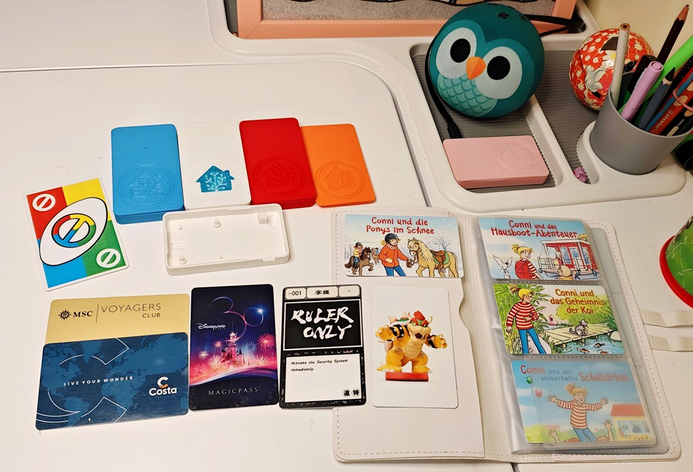
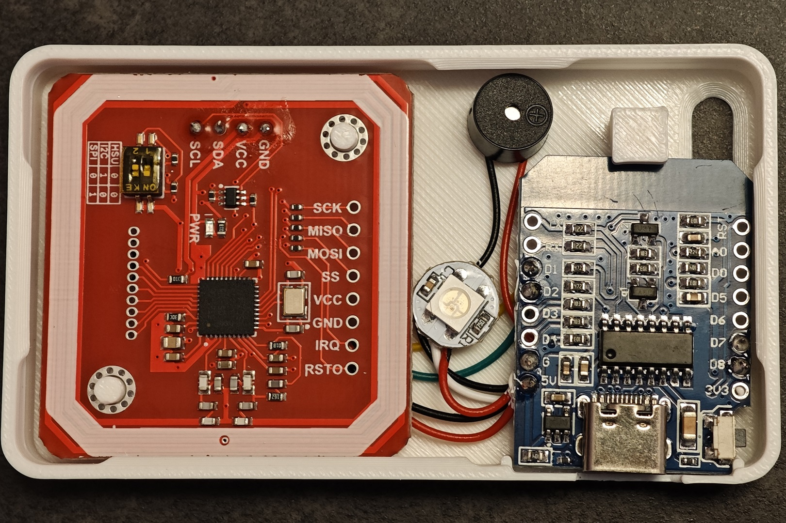
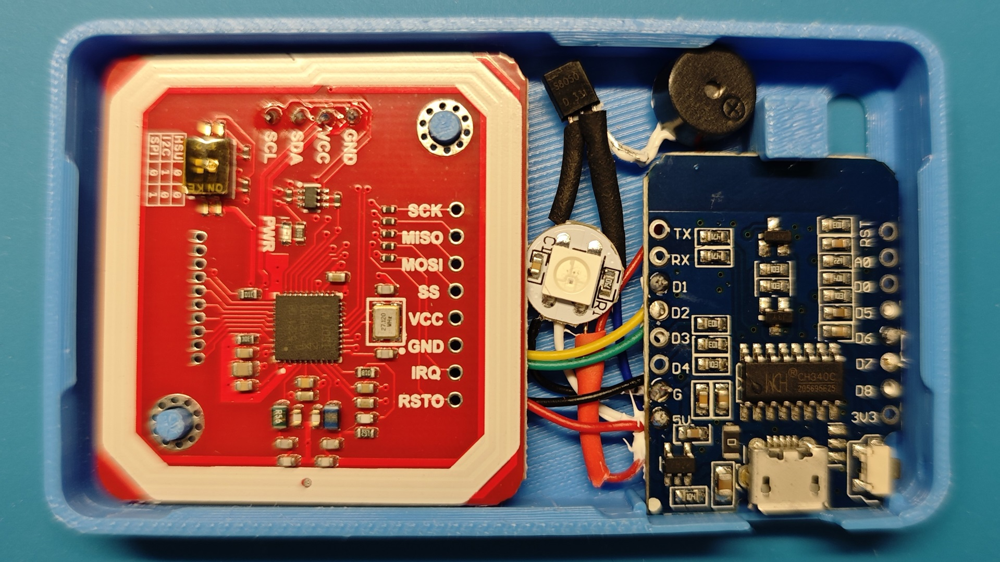

# Enhanced Home Assistant NFC Tag Reader 🚀

> _**Note:** This project is inspired by [Adonno's Tag Reader](https://github.com/adonno/tagreader). I have first created an original version of Adonno's Tag Reader, and afterwards also added some hardware optimizations for better long-term stability and a slightly modified enclosure specifically for the Type-C D1 Mini._

## 🌟 Overview
This repository provides a refined version of the ESPHome-based NFC Tag Reader. By addressing common electrical limitations and updating the mechanical design for new type-C version D1 Mini board, this project ensures a more robust experience for your smart home automation.

  

---

## 🛠️ Project Evolution & Documentation

I have structured the documentation to guide you through the initial build and the subsequent optimizations:

### 1. [Standard Build Guide](./docs/01.original_build.md)
*Step-by-step instructions following the original Adonno design. Perfect for your first build.*

  

### 2. [Hardware Optimizations (Recommended)](./docs/02.hardware_optimization.md)
*The "Core" of this repo. Learn what I tested and how I resolved the **1.4V voltage drop** on the buzzer using an S8050 transistor and prevent potential boot issues by reassigning pins.*

  

### 3. [My Applications & Show Off](./docs/03.my_applications.md)
*See the reader in action: custom NFC cards, jukebox automations, and audio triggers.*

  

### 4. Modified Case for type C D1 Mini

I've made some slight modifications to the original STL files from adonno:
1. Adjusted the opening to fit the USB Type-C version of the D1 mini board.
2. I had some minor issues fitting the PN532 board onto the alignment posts, so I shifted one of them by approximately 0.2mm for a better fit.
3. Updated the Home Assistant logo on the top surface to the latest official version.

*See the file in stl folder.*

---

## 🤝 Acknowledgments
- **Adonno**: For the original inspiration and the brilliant base YAML configuration.
- **ESPHome Community**: For the powerful tools that make these projects possible.

---

## 📜 License

This project is licensed under the **GPL-3.0 License** - see the [LICENSE](LICENSE) file for details. 

As a derivative work of [Adonno's Tag Reader](https://github.com/adonno/tagreader), this repository maintains the same GPLv3 terms to ensure the freedom of hardware and software improvements.