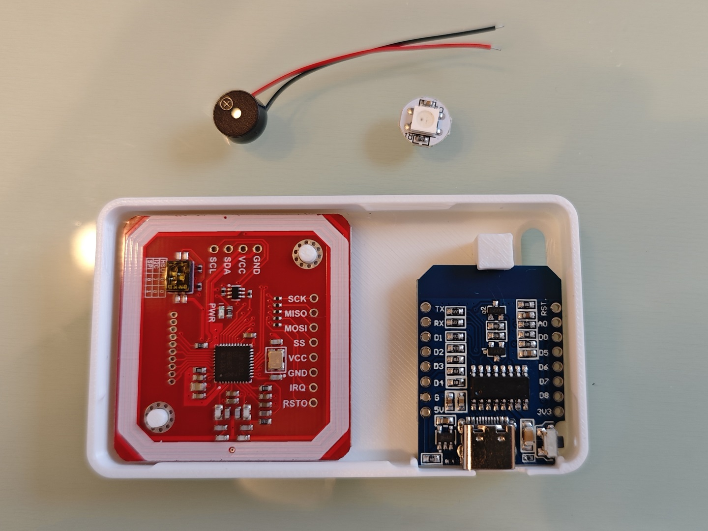
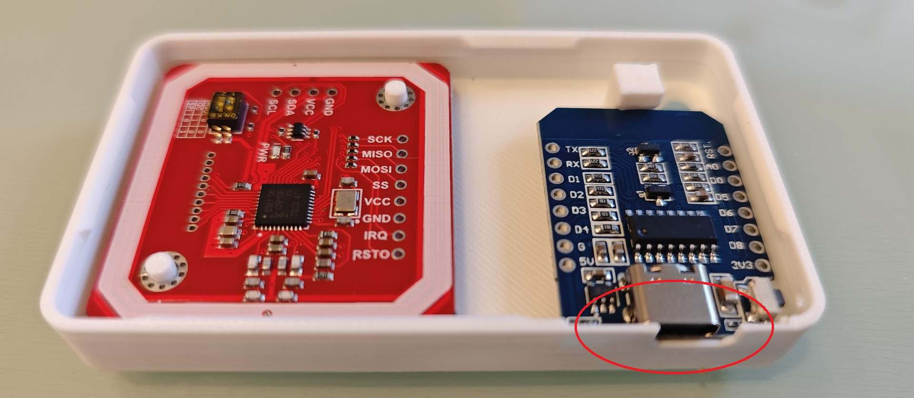
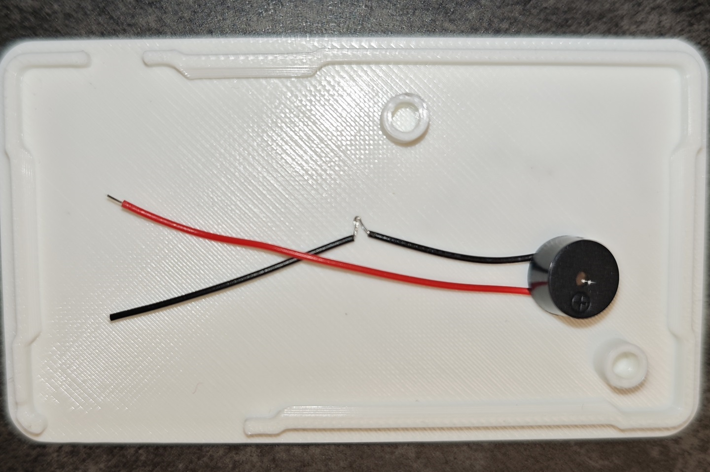
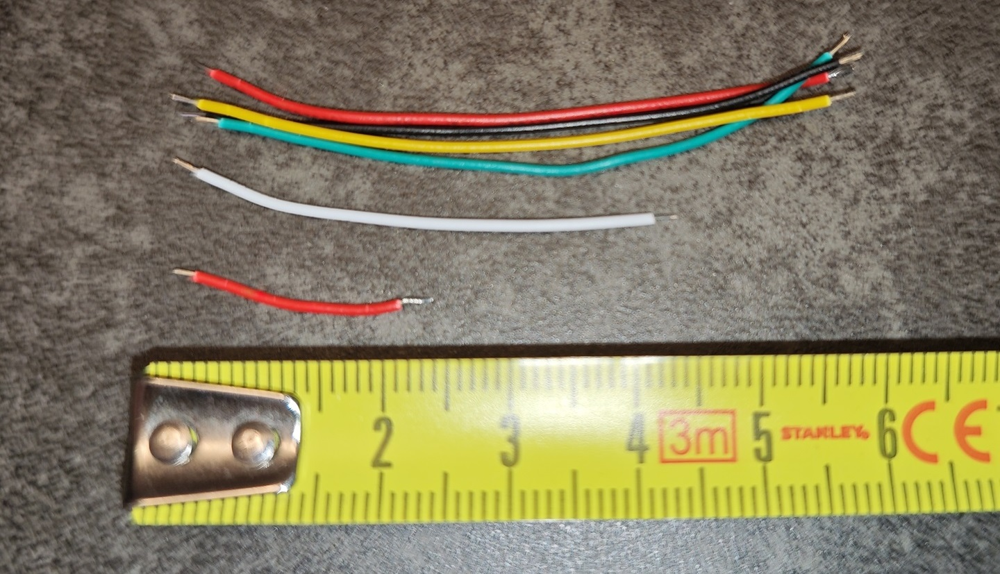
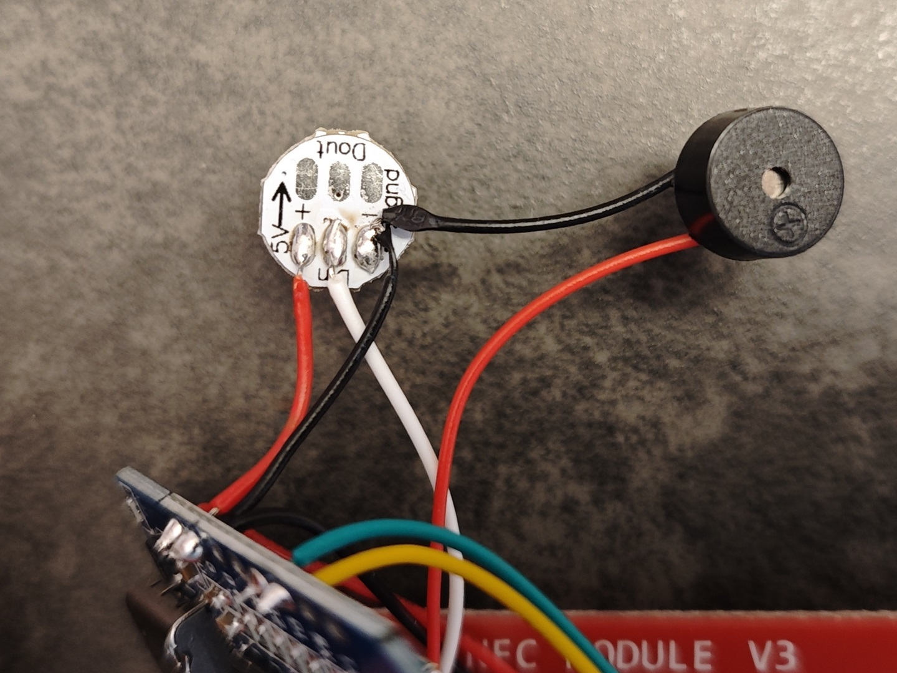
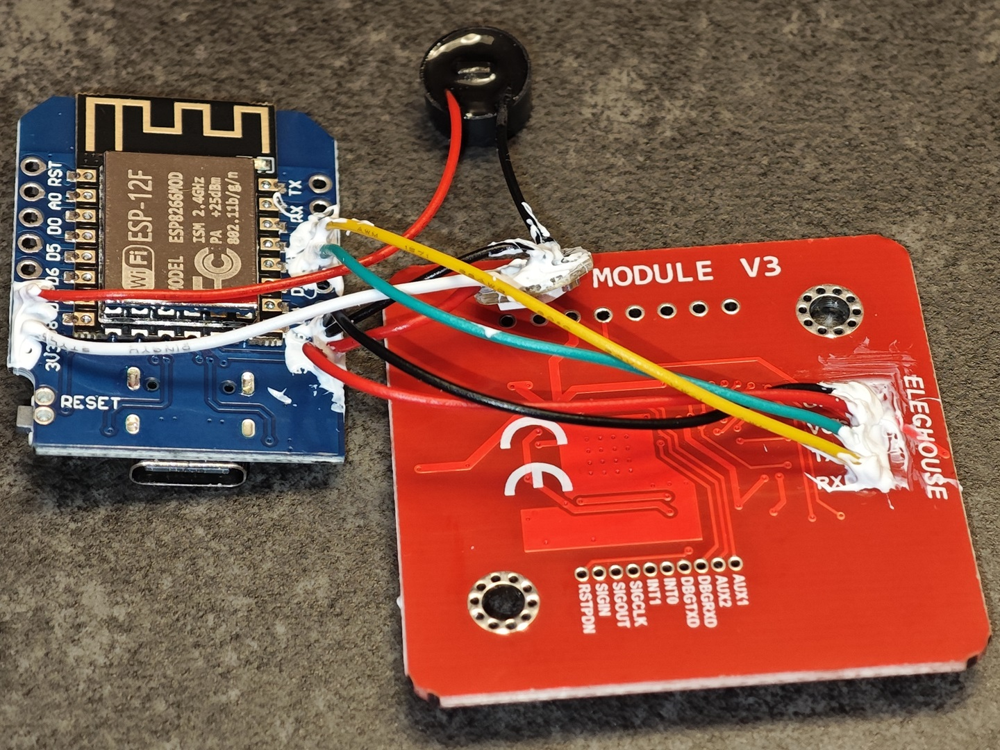
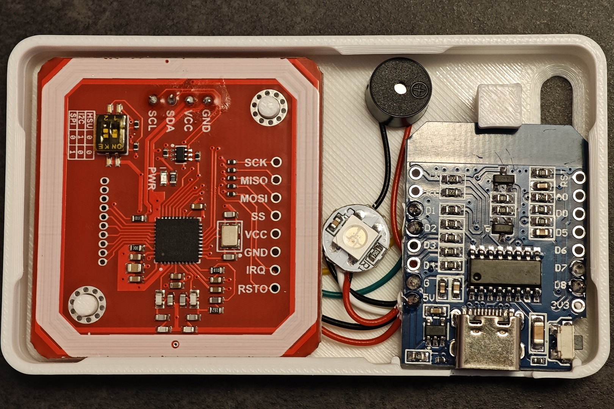
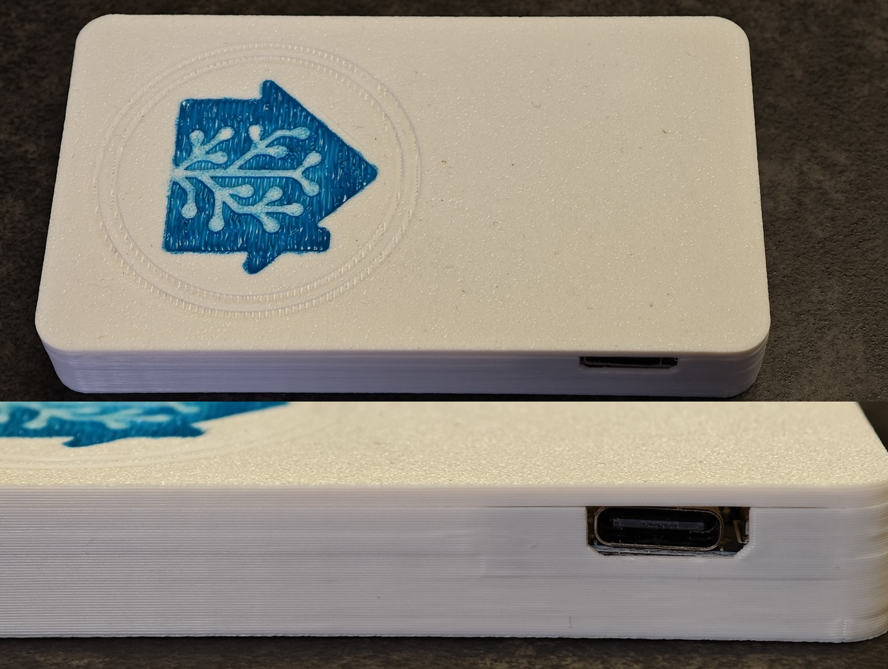

# Standard Build Guide (Version 1.0)

_This guide walks you through the initial assembly of the NFC Tag Reader following the standard Adonno design. This version serves as the baseline foundation before we apply further hardware optimizations in subsequent chapters._

---

## 1. Preparation & Parts List
Before heating up your soldering iron, ensure you have all the necessary components.

  

* **D1 Mini Board:** Note that the original adonno's design uses the Micro-USB version. I mistakenly purchased the **Type-C version**, which leads to a misalignment with the case opening as shown below.
    * **Solution:** If you have the same issue, you can either enlarge the opening with a hobby knife or use my revised STL file (`Case-2_TypeC_Adapted.stl`) which has been adjusted for the Type-C port dimensions.

  

* **NFC Module:** PN532 (Standard version, no fitment issues).
* **Buzzer:** Ensure you use a **5V Active Buzzer (Model 9042)**. I opted for the **pre-wired version**, which saves two soldering points and simplifies installation.
* **WS2812B RGB LED Module:** Do not buy individual LED components. Use a **WS2812B Mini Board**. These come in various shapes; I am using a circular PCB version, which fits perfectly in the logo area.

---

## 2. Preparing the Wiring & "Middle-Strip" Technique
To keep the build as compact as possible, wire management is crucial. My strategy involves a "Daisy-Chain" ground to minimize the number of wires returning to the D1 Mini.

  

* **The Ground Splicing:** To save space, the Buzzer and LED module share a single GND path. 
    * **Method:** Strip a small section of the Buzzer's GND wire approximately **15mm** away from the buzzer. Twist this section together. This joint will be soldered directly to the **GND pad of the LED module**.
* **Wire Specifications:**
    * **PN532 (4 wires):** Total length **55-60mm**. Strip 3-5mm at both ends for soldering.
    * **LED DIN (1 wire):** **45-50mm**.
    * **LED 5V Power (1 wire):** **25-30mm**.

  

---

## 3. Soldering & Component Reinforcement
Follow the wiring diagram carefully. To maintain a clean layout, I recommend soldering the components in the following sequence:

1.  **D1 Mini Base Pins:** Start by soldering **D1, D2, D8**, and **5V**. 
    * **Tip (Power Hub):** For the 5V pin, twist the ends of the two red power wires (one long for PN532, one short for LED) together. Insert this twisted pair through the 5V hole and solder them as a single joint to ensure a solid power distribution hub.
2.  **LED & Buzzer GND:** Solder the pre-stripped "middle section" of the buzzer's black GND wire to the **GND pad** of the LED module (as shown in the photo above).

  

3.  **Solder Buzzer:** Solder the wires from Buzzer to the **D7** (Buzzer Signal) and **GND** pins on the D1 Mini. 
    * **Tip (GND Hub):** For the GND pin, twist the ends of the two black GND wires (one long for PN532, one for LED & Buzzer) together. Insert this twisted pair through the GND hole and solder them as a single joint to ensure a solid GND hub.
4.  **Solder LED Module:** * Solder the **DIN** wire (from D1 Mini D8) and the short **5V** wire to the LED module's respective pads.
5.  **Final Step:** Solder the four interface wires to the **PN532** module.

  

> **Structural Reinforcement:** After soldering, I applied a small amount of **704 RTV silicone glue** to the base of the wires where they meet the PCB. This provides **strain relief**, preventing the thin copper strands from snapping due to bending during assembly.

---

## 4. Final Fitment & Finishing Touches
Once the 704 glue has fully cured and the connections are secured, it's time for the final assembly.

  

1.  **Enclosure Assembly:** Carefully tuck the components into the 3D-printed case. Start with the PN532 at the top, followed by the D1 Mini. 
2.  **Case Alignment:** As you can see in the photo, the modified Type-C opening now fits the cable, though a small gap remains on the right side due to the manual adjustment.

  

3.  **Aesthetic Touch:** I printed the case only in one color. To make the reader stand out, I filled the **Home Assistant logo** on the lid with colored paint, giving it a high-contrast, custom look.

---

### 💡 First Power-On & Flashing
* **Initial Observation:** In my specific case, when I first powered on the device, the **WS2812B LED stayed bright white**. This continued until the firmware was successfully flashed. If you encounter the same situation, don't panic—it may just be the uninitialized state of the LED.
* **Flashing the Firmware:** I used the **ESPHome Add-on in Home Assistant**. For the configuration, I used Adonno's original `tagreader.yaml`, only modifying the `substitutions` section, WiFi details, and API passwords.
* **Final Result:** Once the "Success" message appeared in the logs, I performed a power cycle (unplug and replug the Type-C cable). The reader then initialized perfectly and began working as expected.

---

### ⏭️ Next Step
To my experience, this standard build has been working perfectly so far. However, I did notice some potential **electrical limitations** during the process, which led me to implement several improvements when building my second Tag Reader.

Check out **[Hardware Optimization](./02.hardware_optimization.md)** if you are interested in spending a bit more time to build a more robust and stable version, featuring an **S8050 NPN Transistor** driver and **1N4148 Diode** voltage shifting.
