# Hardware Optimization: Enhancing Stability & Reliability

> _**Disclaimer:** The original TagReader design works well for most users, and my initial build following that scheme has been operating without any issues. However, based on technical discussions within the community and an analysis of component datasheets, I have proposed the following optimizations from a purely theoretical and long-term reliability perspective. These "patches" aim to further enhance the robustness of the device._

---

## 1. 🔉 Buzzer Drive Optimization (The Transistor Fix)

### The Problem: GPIO Current Limits
In the standard build, the buzzer is driven directly by the **D7 (GPIO13)** pin. 

* **Observation:** During testing, the voltage on D7 dropped to approximately **1.1 ~ 1.6V** when the buzzer was active.

<div align="center">
  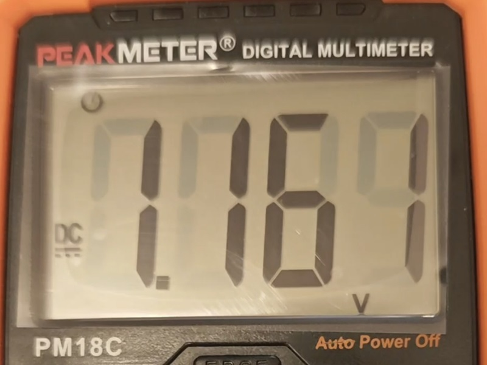
</div>

* **Analysis:** The ESP8266 pins have a very limited **sourcing current** capacity (approx. 12mA). A typical active buzzer requires 30mA–50mA. This overload results in faint audio and puts stress on the MCU's internal circuitry.

### The Solution: S8050 NPN Transistor
I introduced an **S8050 NPN transistor** to act as an electronic switch.


* **Mechanism:** The D7 pin now only needs to provide a tiny trigger current to the transistor's Base. The transistor then allows the buzzer to draw full power directly from the 5V rail.
* **Simplification:** To keep the build compact, I have driven the Base directly (though a 1kΩ resistor is technically recommended, it can be omitted in this specific low-frequency application to save space).

---

## 2. 🔦 WS2812B Logic Level Shifting (Diode Drop)

### The Problem: 3.3V vs. 5V Logic
While the WS2812B can operate between 3.5V and 5.3V, it is powered by the **5V** rail in this project. Its datasheet specifies that a logic "HIGH" (to the DIN pad) must be at least $0.7 \times V_{CC}$.

* **Calculation:** At 5V supply, $5V \times 0.7 = 3.5V$.
* **Conflict:** The D1 Mini outputs a **3.3V** signal. This puts the signal slightly below the theoretical threshold, which can occasionally lead to flickering or incorrect colors.

### The Solution: Small Signal Diode (1N4148 / 1N4007)
I used a **1N4148** diode (chosen for its small footprint) in series with the LED's VCC line.


* **Mechanism:** The diode creates a voltage drop of ~0.7V. The LED now operates at approx. **4.3V**.
* **New Threshold:** $4.3V \times 0.7 \approx 3.01V$. Now, the D1 Mini's **3.3V** signal is safely above the threshold.

---

## 3. Avoiding Boot Failures (Pin Reassignment)

### The Problem: Strapping Pins & Interference
The ESP8266 has three "strapping pins" that must be in a specific state at boot time:
1. **GPIO15 (D8):** Must be **LOW**.
2. **GPIO0 (D3):** Must be **HIGH**.
3. **GPIO2 (D4):** Must be **HIGH**.

<div align="center">
  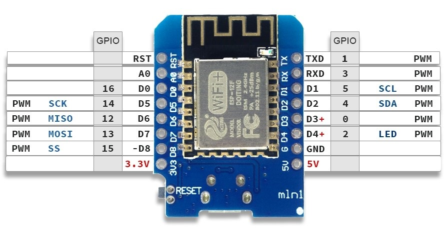
</div>

In the original design, the LED is often connected to **D8 (GPIO15)**. 
* **The Conflict:** While the WS2812B's DIN (Data In) is internally pulled to GND by default, environmental EMI or leakage current from the 5V rail can occasionally pull this pin HIGH during the millisecond the device powers on. 
* **The Result:** This causes the ESP8266 to enter an invalid boot mode, leading to possibly "hanging" or boot failures.

### The Solution: Shifting to D6 & D7

To avoid the boot-up issues associated with the D8 pin, it is best practice to avoid those strapping pins. I simply shifted the connections over to the neighboring neutral pins. In my optimized build, I reassigned them as follows:

* **Buzzer:** Connected to **D6**.
* **LED Module:** Connected to **D7**.

#### Why this change?
There isn't a strict functional difference between D6 and D7 for these components; both are excellent "neutral" pins that don't interfere with the ESP8266's boot sequence. By moving away from **D8 (GPIO15)** — which must be pulled low at startup — we ensure the device boots reliably every time.

**For a clearer understanding of the optimized circuit, please refer to the schematic below:**

<div align="center">
  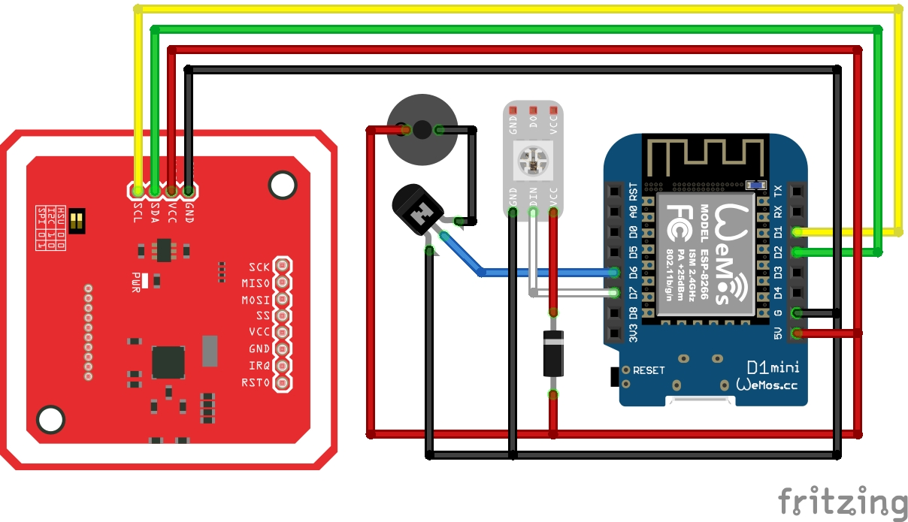
</div>

> [!IMPORTANT]
> **Update Your YAML Configuration**
> You need to modify the pin number in the following sections in your `tagreader.yaml` to match the new hardware layout:

**1. For the Buzzer (Shifted to D6):**

```yaml
# Define the buzzer output
output:
  - platform: esp8266_pwm
    pin: D6
    id: buzzer
```

**2. For the LED Module (Shifted to D7):**

```yaml
# Configure LED
light:
  - platform: neopixelbus
    variant: WS2812
    pin: D7
```

---

## 4. V2.0 Build Process & Photos

_This section documents the assembly of the optimized version, focusing on the integration of the transistor driver and the level-shifting diode._

### Step 1: Component Preparation
Before heating up the soldering iron, lay out the new additions alongside the standard components.

<div align="center">
  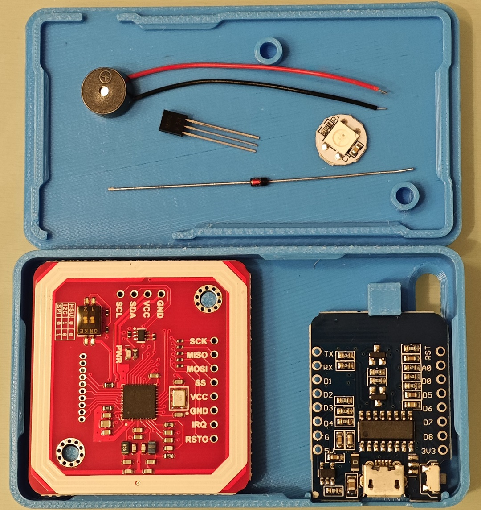
</div>

* **Added Hardware:** S8050 NPN Transistor and 1N4148 Diode.
* **Pin Shifting:** For this build, we are migrating to **D6** for the Buzzer and **D7** for the LED to ensure a smooth boot sequence.

<div align="center">
  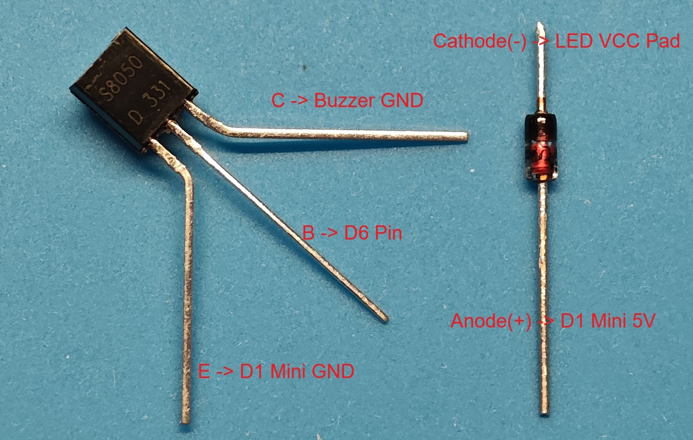
</div>

---

### Step 2: Preparing Wires & Pre-cutting
To keep the internals organized within the small 3D-printed case, precise wire management is key.

<div align="center">
  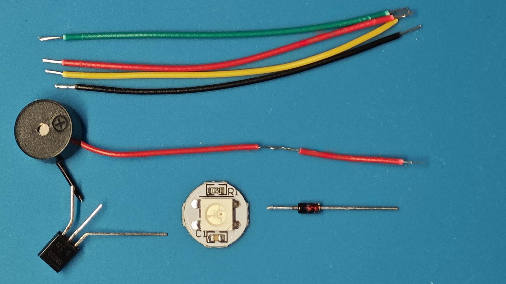
</div>

* **Wire Set:** Prepare 6 wires (Red, Black, Yellow, Green, White, Blue) at approximately **60mm** each, plus one extra **30mm** black wire.
* **Buzzer Modification:** * Cut the buzzer's **black wire** short, leaving only about **5-10mm**.
    * On the buzzer's **red wire**, strip a small section of insulation about **35mm** away from the buzzer. This will be used to wrap around the Diode's Anode.

---

### Step 3: Soldering the Buzzer & LED Hub
I recommend soldering the peripheral hub (Buzzer + LED + Transistor) first before connecting them to the D1 Mini.

<div align="center">
  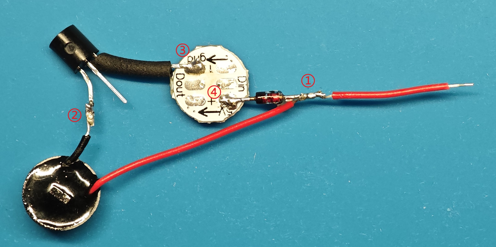
</div>

Follow this specific soldering order to keep the assembly compact:

1. Wrap the stripped section of the buzzer's **red wire** around the **Anode** of the 1N4148 diode and solder it securely.
2. Solder the shortened buzzer **black wire** to the **Collector (C)** pin of the S8050 transistor.
3. Solder the **Emitter (E)** pin of the transistor to the LED module's **GND OUT** pad. 
    * *Note:* The LED module has both GND IN and GND OUT; they are internally connected. Using the OUT pad here helps with cable routing. 
    * *TIP:* I slipped a small piece of **heat-shrink tubing** over the exposed Emitter pin before soldering to prevent shorts.
4. Solder the **Cathode (black stripe side)** of the diode to the LED module's **VCC IN** pad.
    * *TIP:* After soldering, I slid a larger heat-shrink tube over the entire diode to protect all exposed metal parts and ensure insulation.

---

### Step 4: D1 Mini Pin Soldering (Initial)
Start by connecting the primary signal and ground wires to the D1 Mini. Using a systematic color code helps avoid mistakes later.

<div align="center">
  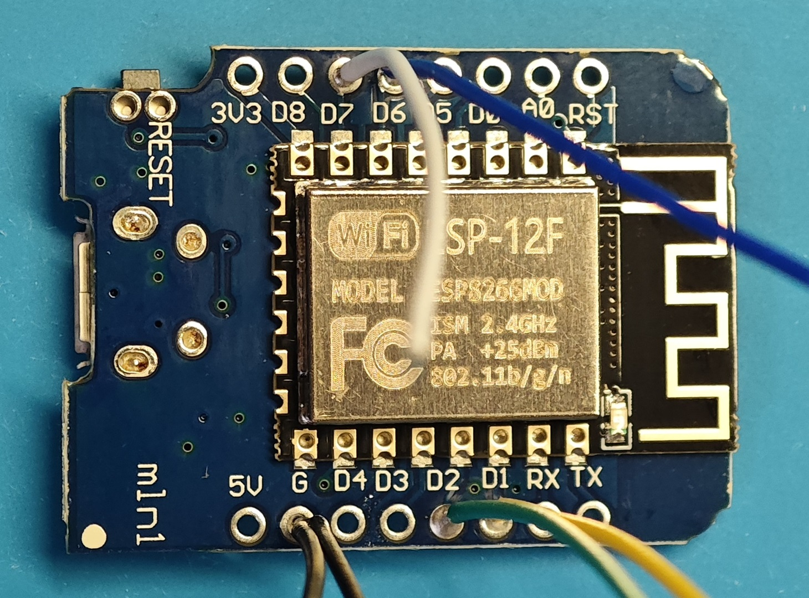
</div>

* **GND:** Twist **two black wires** together and solder them into the **GND** pad.
* **I2C (PN532):** Solder the **Yellow wire** to **D1** and the **Green wire** to **D2**.
* **Peripherals:** Solder the **Blue wire** to **D6** (Buzzer signal) and the **White wire** to **D7** (LED signal).

---

### Step 5: Finalizing the Hub Connections
Now, connect the D1 Mini's wires to the Buzzer/LED hub we prepared in Step 3.

* **5V Power Rail:** Twist the **Buzzer's red wire** together with the remaining **Red wire** and solder them both into the **5V** pad on the D1 Mini.
* **Buzzer Driver (Blue Line):** Solder the other end of the **Blue wire** to the **Base (B)** pin of the S8050 transistor. 
> [!TIP]
> Remember to slide a small piece of **heat-shrink tubing** onto the blue wire before soldering. Once the joint is cool, slide it over the metal and heat it to secure.
* **LED Data (White Line):** Solder the other end of the **White wire** to the **DIN** pad of the LED module.
* **Ground Bridge:** Solder the remaining **short black wire** to the **GND IN** pad on the LED module.
* **PN532 Final Link:** Finally, solder the four I2C wires (GND, 5V, SDA, SCL) to their respective pads on the PN532 module.

<div align="center">
  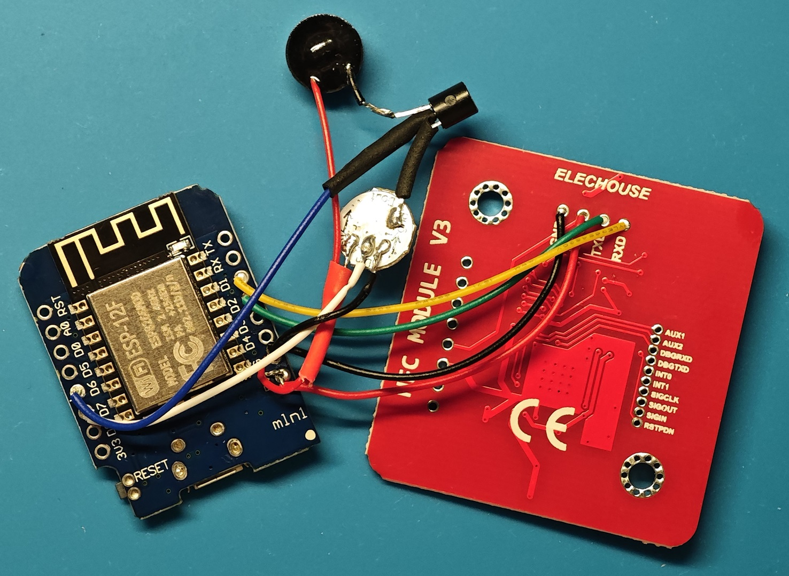
</div>

---

### Step 6: Final Reinforcement & Assembly
With all connections tested and working, it's time to ruggedize the build for daily use.

<div align="center">
  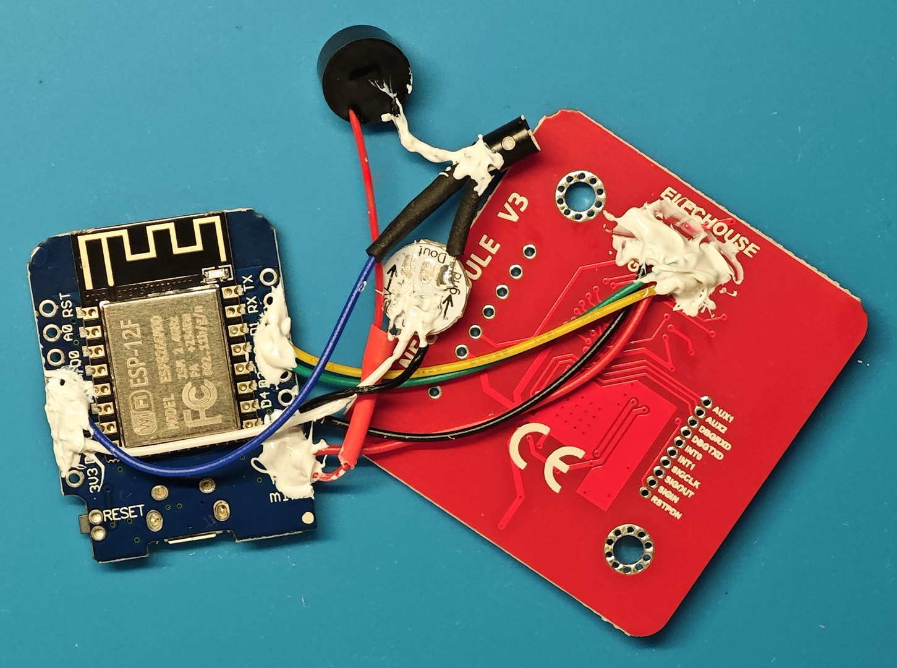
</div>

* **Insulation & Protection:** Just like the first version, I applied **704 Silicone Glue** to the wire roots on the D1 Mini and the delicate transistor/diode joints. This prevents wires from snapping due to vibration or repeated handling.
* **The "Tight Fit" Challenge:** After the glue is fully cured, carefully tuck the wires into the case. With the addition of the transistor and diode, the interior is noticeably more crowded. 
* **Aesthetics Matter:** The primary reason I chose this specific wiring and routing path was to ensure the **LED module remains perfectly centered** within the enclosure. While it makes the internal cable management more challenging, the symmetrical light output in the final product is well worth the effort.

<div align="center">
  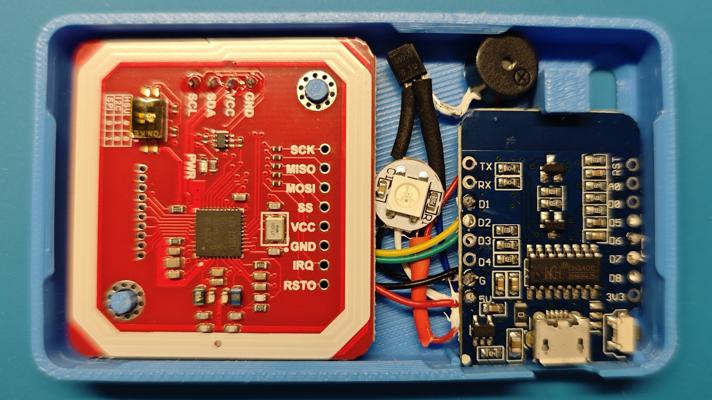
</div>

---

### 💡 Note on Construction
The soldering sequence described above is just one way to achieve the result. As long as your wiring matches the schematic and the pin assignments are correct, feel free to improvise based on your tools and comfort level.

For instance, an alternative could be to **solder the Diode's Anode directly to the 5V pin** on the D1 Mini, and then use that sturdy metal leg as a "bus bar" to attach the other red power wires. This might save even more space depending on how you've routed your cables.

---

## 🚀 Summary of Benefits

1. **Electrical Safety:** The S8050 transistor acts as a buffer; the D1 Mini's GPIO pins are no longer directly driving the inductive load of the buzzer, preventing potential MCU burnout.
2. **Enhanced Audio:** By using a dedicated driver circuit, the buzzer receives a full, stable 5V supply, resulting in a **louder and clearer "beep"** compared to the direct GPIO drive.
3. **Boot-up Reliability:** By migrating to D6/D7, we've bypassed the ESP8266's boot-strap pin requirements, ensuring the device never gets "stuck" during a restart.
4. **Signal Integrity:** The 1N4148 diode provides a precise logic level shift, ensuring the WS2812B receives a clean signal and eliminating the "flickering first pixel" issue.
5. **Centered Aesthetics:** Despite the tight internal space, this specific routing ensures the LED is perfectly centered, providing a professional, symmetrical light glow through the enclosure.

---

## 🛠️ Final Checklist Before Closing

* [ ] **Check your polarities!** Double-check the 1N4148 diode direction (black stripe) and the S8050 pinout (E-B-C) against the schematic.
* [ ] **Short Circuit Prevention:** Ensure all exposed metal joints (especially the transistor legs and diode) are properly insulated with heat-shrink tubing or 704 glue.


---


## 💡 First Power-On & Flashing

Now that the hardware is assembled and the case is closed, it's time to bring the device to life. 

### 🧐 What to Expect on First Boot
When you first plug in the USB cable to flash the firmware, you may notice a specific behavior:

> **Note on Startup Noise:** > During the initial bootup (before the firmware is fully loaded), you might notice a faint **"clicking" or "ticking"** sound from the buzzer. 
> 
> * **Why?** This is due to the "floating" state of the GPIO pins on the D1 Mini during the boot sequence. Without a firm "LOW" signal, the sensitive S8050 transistor may intermittently trigger.
> * **Is it a problem?** No. This is a common phenomenon in transistor-driven circuits. The sound will disappear as soon as the ESPHome firmware initializes and takes control of the GPIO pins.

### ⚙️ Firmware Configuration
Since we migrated the pins for better stability, your `tagreader.yaml` **must** be updated before flashing. If you use the old configuration, the buzzer and LED will not respond.

Ensure your YAML includes these updated pin assignments:

| Component | Old Pin (V1.0) | **New Pin (V2.0)** |
| :--- | :--- | :--- |
| **Buzzer** | D7 | **D6** |
| **LED** | D8 | **D7** |

### 🌙 Managing the PN532 "Ghost Light"
If you look closely at your PN532 board, you'll notice a small red Power LED. Once powered on, it stays lit indefinitely. 

* **The Issue:** This LED is surprisingly bright and will bleed through the 3D-printed enclosure, creating a faint red glow in your room at night.
* **The Fix:** To maintain a "stealth" look and avoid disturbing your sleep, I simply covered the red LED with a small piece of **thick, black double-sided tape** (or electrical tape) before closing the case. This effectively kills the light leak without affecting the board's performance.

---

### ⏭️ Next Step

With these hardware optimizations, you now have a rock-solid, professional-grade Tag Reader that’s built to last. The buzzer is crisp, the power is stable, and the Type-C connection makes it future-proof.

Now comes the most exciting part: **What can you actually do with it?**

Check out **[My Applications & Show Off](./03.my_applications.md)** to see how I transformed these readers into a "Magic Jukebox" for my daughter, implemented "Music Follow Me" logic, and created the "Master Key" for screen-free home automation.