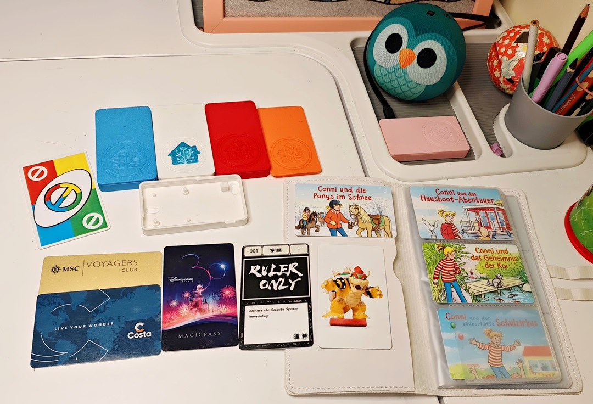
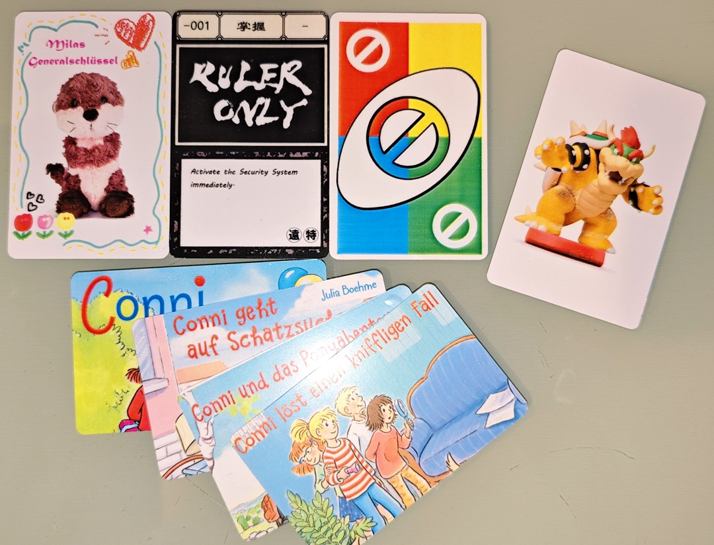
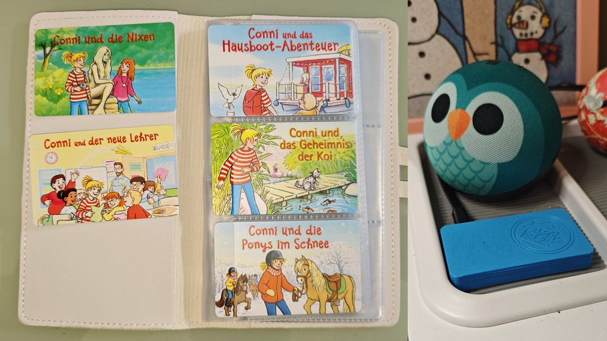
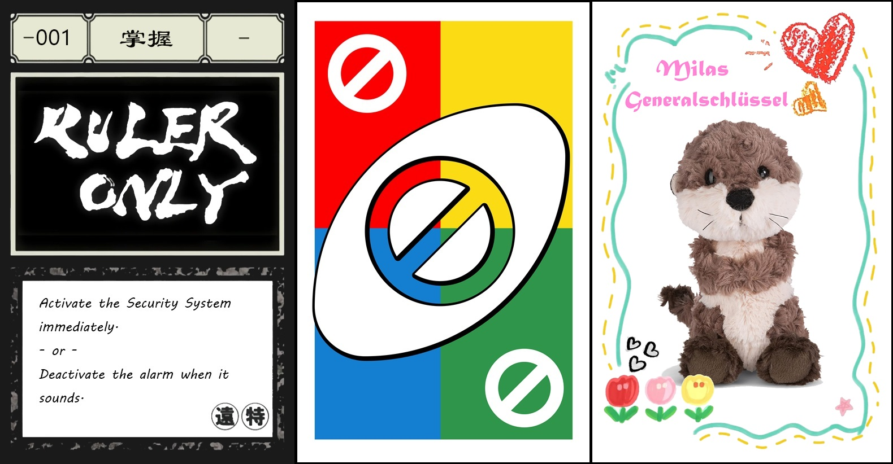
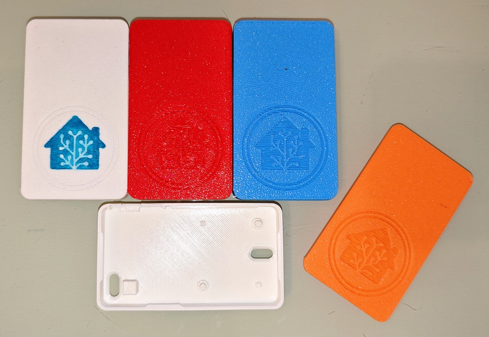

# 🚀 My NFC Tag Applications & Crafting Guide

I've just finished the second iteration of my NFC Tag Readers. I believe that great smart home automation should be more than just functional — it should be engaging, beautiful, and even a bit of an art form. For my latest project, I've spent time perfecting not just the readers, but the physical tags themselves, creating a tactile and aesthetic gateway to our home.

<div align="center">
  
</div>

---

## 01. Crafting the Tags: The Tactile Experience

Before diving into the code, let’s talk about the physical media. The cards are what make the experience "real." I experimented with two methods to achieve a retail-grade look:

<div align="center">
  
</div>

* **The Pro Way (Direct Printing):** Following the Home Assistant Tag page recommendations, I got a **Canon TS705** with a dedicated **PVC card tray** and **inkjet-printable NFC cards**. The result is a professional, smudge-proof finish that feels like a real product. The guide on this page (https://www.home-assistant.io/integrations/tag/) is very comprehensive, just follow the description there.
* **The Budget Way (Adhesive Paper):** I initially bought glossy cards that weren't inkjet-compatible. I recovered by printing the art on adhesive photo paper. 
    * **The Craft:** This method requires a bit more effort. To ensure full edge-to-edge coverage, I print the images slightly oversized (8.8 x 5.6 cm). After applying them to the card, I carefully trim the excess with scissors for a clean, flush finish. It’s a great, cost-effective way to repurpose "wrong" or cheap cards.

* 💡 **Worth mentioning:** Because this Jukebox automation only relies on the **Tag ID** to trigger actions and doesn't require writing specific data to the chip, you can repurpose almost any NFC card you have lying around. Old hotel key cards, theme park tickets, or even some transit cards (ISO14443A) can be turned into music tags. Just scan them once, grab the ID, and map it in your configuration!

It's time to create your own artworks! Happy printing!

> [!TIP]
> **The Hybrid "Amiibo-Automation" Card**
>
> For Nintendo Switch players, **NTAG215** cards offer a brilliant "Dual-Purpose" opportunity. Since most Home Assistant automations rely solely on the unique **Tag ID** as a trigger, the actual data stored on the card's memory doesn't interfere with your smart home logic.
>
> **Double the Fun:** You can flash the card with **Amiibo data** first, then use it in Home Assistant. I print the **Album Art** on the front and the **Amiibo character artwork** on the back. 
> One single card now leads a double life: It’s a collectible character in *Super Mario Galaxy* on your Switch, and a magic music key for your Sonos. 

> [!IMPORTANT]
> _Note: Be sure to flash the Amiibo data first, as this process permanently "locks" the card's data partition — but don't worry, the Tag ID remains readable for Home Assistant!_

---

## 02. Primary Application: A Magic Jukebox for My Daughter

While the most common use case for tags is a Jukebox, I built for my daughter. She loves her collection of audiobooks and children's stories. Instead of using a screen, she simply picks a card with the book's cover and taps it on the reader.

<div align="center">
  
</div>

### "Music Follows Me" - Smart Playback Logic
I wanted to push the boundaries of the standard automation to make it a little more "smart." Since I have now two Sonos speakers in multiple rooms, I added a **"Music Follows Me"** (Smart Transfer) feature in the automation to make the experience seamless as she moves around the house.

**How it works:**
When a tag is scanned, the automation checks if that specific album is already be played on another media player:
* **The Hand-off:** If it's playing elsewhere, it uses `music_assistant.transfer_queue` to move the playback (and the exact progress) to the current room.
* **Fresh Start:** If not active, it starts the media from the beginning.

I have already planned for my next project: a high-fidelity media player based on the **ESP32-S3 + PCM5102A (I2S DAC)**. This "Music Follow Me" logic is particularly useful here, as it will allow me to seamlessly switch the playing queue between my Sonos system and my own custom-built hardware. 

You can find the YAML for the automaction below:

```yaml
#+++++++++++++++++++++++++++++++++++++++++++++++++++++++++++++++++#
# NFC-Triggered Music Playback
#+++++++++++++++++++++++++++++++++++++++++++++++++++++++++++++++++#
- alias: TagScan_PlayMusic
  max_exceeded: silent
  variables:
    # Map scanner device ID to media player entity ID
    media_players:
      afba1824b174607d734bxvxv0896dcf0: media_player.sonos_livingroom_mass
      36efe8f67c6b9gegr207cc9afb408126: media_player.sonos_kidsroom_mass
    # All my Music Assistant media players
    media_player_mass_list:
      - media_player.sonos_livingroom_mass
      - media_player.sonos_kidsroom_mass
      - media_player.sonos_office_mass
    # Map tag ID to content
    tags: !include tag_list.yaml
  triggers:
    - trigger: event
      event_type: tag_scanned
  conditions:
    # Test that we support this device and tag
    - "{{ trigger.event.data.tag_id in tags }}"
    - "{{ trigger.event.data.device_id in media_players }}"
  actions:
    - variables:
        target_player: "{{ media_players[trigger.event.data.device_id] }}"
        media_id: "{{ tags[trigger.event.data.tag_id].media_id }}"
        media_type: "{{ tags[trigger.event.data.tag_id].media_type }}"
        source_player: >-
          
          
          
            
              
            
          
          {{ found.entity_id if found.entity_id is not none else '' }}
    - choose:
        # If the album is being played on another media player, transfer the queue to target player
        - conditions: "{{ source_player != none and source_player != 'None' and source_player != '' }}"
          sequence:
            - action: music_assistant.transfer_queue
              target:
                entity_id: "{{ target_player }}"
              data:
                source_player: "{{ source_player }}"
                auto_play: true
      default:
        # By default, start fresh playback on the target media player
        - action: music_assistant.play_media
          target:
            entity_id: "{{ target_player }}"
          data:
            media_id: "{{ media_id }}"
            media_type: "{{ media_type }}"
    # timeout before we allow processing next scan
    - delay: 2
```

> [!TIP]
> **The Code Structure:**
> I keep my configuration clean by decoupling the data from the automation. I store all tag mappings in a separate `tag_list.yaml`.
> This way, whenever I want to add a new album or change a tag, I only need to edit the simple data file instead of digging through a long and complex `automation.yaml` to find the right lines. It makes the whole system much easier to maintain and scale.
>
> *Of course, a quick "Reload Automations" in Home Assistant is still required after editing `tag_list.yaml` to make the new mappings live!*

Example of `tag_list.yaml`:
```yaml
# Example: List of all tags for Automation TagScan_PlayMusic
04-A3-74-83-3B-3A-4C:
  media_id: Conni Und Das Hausboot-Abenteuer
  media_type: album
04-D3-F6-7F-3B-3A-4C:
  media_id: Conni und das Abenteuer in der Wildnis
  media_type: album
04-13-A0-97-3B-3A-4C:
  media_id: Conni und der beste Spürhund der Welt
  media_type: album
```
---

## 03. Beyond Music: Physical Automation Triggers
NFC tags are incredibly reliable "physical buttons" for routines where voice or apps feel clunky:

* **Security Control:** A hidden tag near the door allows us to arm the security system or toggle "Away Mode" with a simple tap.
* **Notification Management:** I have a "Clear Notifications" tag. Scanning it instantly acknowledges and clears all pending alerts across our dashboards and phones.
* **The "Universal Key" for Kids:** Basically, NFC tags can replace any complex dashboard operation — which is a game-changer for children who don't have (or shouldn't have) their own phones. I gave my daughter a "✨Master Key🗝️" card: whatever new automation she dreams up, I simply program it to her card. It gives her a sense of magic and control over her own environment without needing a screen.

<div align="center">
  
</div>

### 💡 Quick Guide: Two Ways to Trigger Automations via NFC

When setting up your logic in Home Assistant, you generally have two paths depending on how flexible you want your system to be:

1. **The Tag Trigger (Simple & Direct):**
   This is the standard way. You select "Tag" as your trigger type and specify a **Tag ID** and/or a **Device ID**.
   * **Best for:** One-off automations like "Arm Security" or "Toggle Desk Light."
   * **Pros:** Easy to set up via the UI; very reliable for fixed locations.

```yaml
automation:
  triggers:
    - trigger: tag
      tag_id: A7-6B-90-5F
      device_id: 0e19cd3cf2b311ea88f469a7512c307d
```

2. **The Event Trigger (Dynamic & Scalable):**
   This method listens for the `tag_scanned` event across the entire system.
   * **Best for:** Complex setups like a Jukebox logic.
   * **How it works:** You use an Event Trigger to capture any tag scan, then use the `tag_id` and `device_id` from the event data to decide what happens next (e.g., looking up in your tag list).
   * **Pros:** Much easier to manage 50+ tags; allows you to identify *which* device scanned the tag to route music correctly.

```yaml
automation:
  triggers:
    - trigger: event
      event_type: tag_scanned
  conditions:
    # Test that we support this device and tag
    - "{{ trigger.event.data.tag_id in tags }}"
    - "{{ trigger.event.data.device_id in media_players }}"
```


---
<div align="center">
  
</div>

🚀 Anyway, that’s my V2.0 journey! I'm super curious—what are you guys tapping your tags for? Any crazy automation ideas? 🙌
